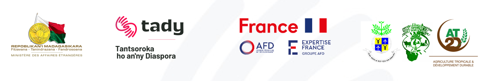

::: {.home-shell}

::: {.compact-hero}

FORMATION · AGRICULTURE NUMÉRIQUE

# Introduction à l’intelligence artificielle pour une Agriculture de Précision et Durable

Une formation pratique destinée aux étudiants de la Mention Agriculture Tropicale et Développement Durable (AT2D) de l’Ecole Supérieure de Sciences Agronomiques de l’Université d’Antananarivo, conçue dans le cadre du projet **TADY** et **Expert'Izy**.

Le cours introduit les fondamentaux de la programmation **Python**, l’**analyse de données agricoles**, le **machine learning** et l’**analyse géospatiale**.

[Découvrir le programme](programme.qmd){.btn .hero-button}

:::

:::

::: {.partners-section}

PARTENAIRES DU PROJET

  

:::

::: {.about-grid}

::: {.about-card}

## À propos de la formation

Ce cours a été conçu pour accompagner l’apprentissage des méthodes numériques appliquées à l’agriculture, depuis les bases de Python jusqu’au machine learning et aux systèmes d’information géographique.

L’objectif est de proposer un parcours progressif, pratique et directement exploitable à partir de données agricoles, climatiques et géospatiales.

:::

::: {.about-card}

## À propos moi

Je suis **Mioratina, Data Scientist**, spécialisée en intelligence artificielle, analyse de données et systèmes d’information géographique.

Je possède **11 années d’expérience internationale** dans le développement de systèmes analytiques et de solutions d’aide à la décision déployés à l’échelle internationale.

:::

:::
